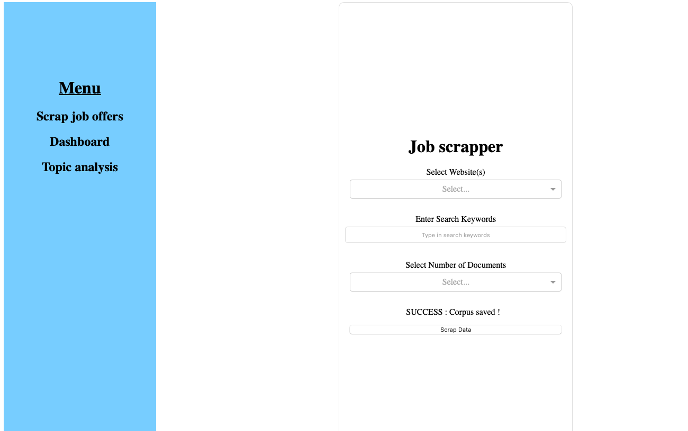
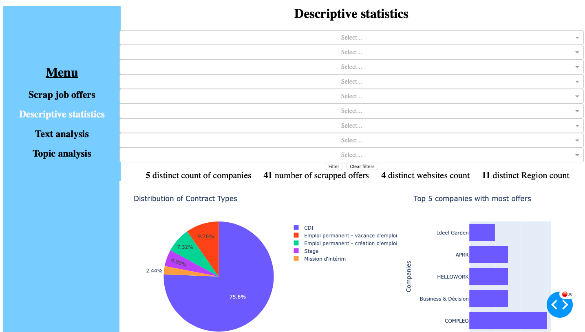
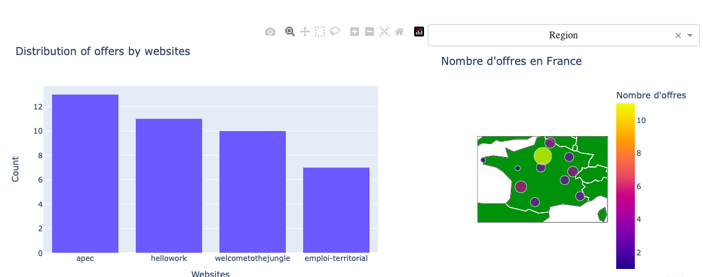
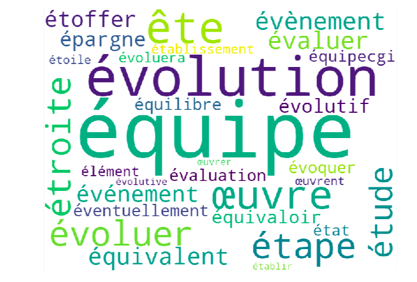
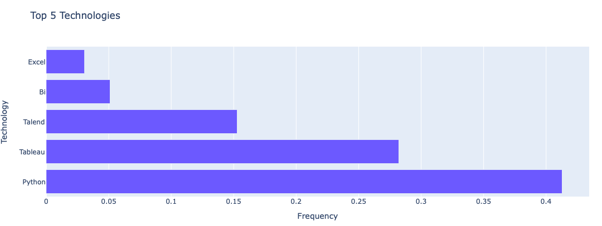
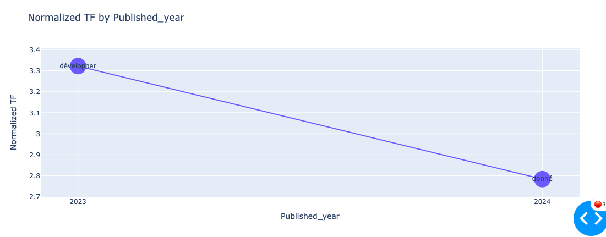

# NLP Scrapping et Analyse d'offres d’emplois

Dans ce repertoire git hub vous trouverez les fichiers sources permettant le lancement d'une application permettant le scrapping et l'analyse d'offres d'emploi. 

## Lancement des conteneurs de l'application

L'intégralité de l'application est présente dans des conteneurs docker. Pour lancer ces conteneurs il faut:
- Installer Docker Desktop
- Lancer Docker Desktop
- À l'aide d'un terminal, se placer dans le dossier ``Src`` du répertoire du projet git hub et lancer la commande suivante dans la terminale:
``docker-compose up --build``
- Pour finir dans votre navigateur vous pouvez vous rendre à l'adresse suivante ``http://localhost:8050``

Une fois ces étapes réalisées vous devriez arriver sur la page d'accueil de notre application.

## Fonctionnalité de l'application 

Une fois l'application lancer nous arrivons sur la page Job scrapper.

### Job scrapper

Sur cette page vous avez la possibilité de scrapper de nouvelles offres d'emploi. 
- L'onglet "Select Website(s)" permet de choisir quel site vous souhaiter scrapper. 
- Avec l'onglet "Enter Search Keywords" vous pouvez choisir en fonction de quelle mot vous souhaiter scrapper. 
- Pour finir le menu déroulant "Select Number of Documents" permet de sélectionner le nombre d'offres que l'utilisateur souhaite scrapper.

Une fois la sélection faite, vous pouvez appuyer sur le bouton scrap data pour lancer le scrapping qui va récupérer les offres, réaliser une lemmatisation de celle-ci et les enregistrer sur la base de données.

### Descriptive statistics

Dans la sous section Dashboard nous réalison l'analyse basique des offres. De plus dans cette section nous avons la possibiliter d'appliquer plusieur filtre a cette analyse comme on peut le voir sur les images ci-dessous

### Text analysis

Dans cette onglet nous réalisons une analyse nlp des offres d'emploi.
Nous réalisons 3 analyses:
- Tout dabord un word cloud:

- Ensuite une recherche des technologie les plus recherché:

- Pour finir une recherche des mot les plus "tendence"

